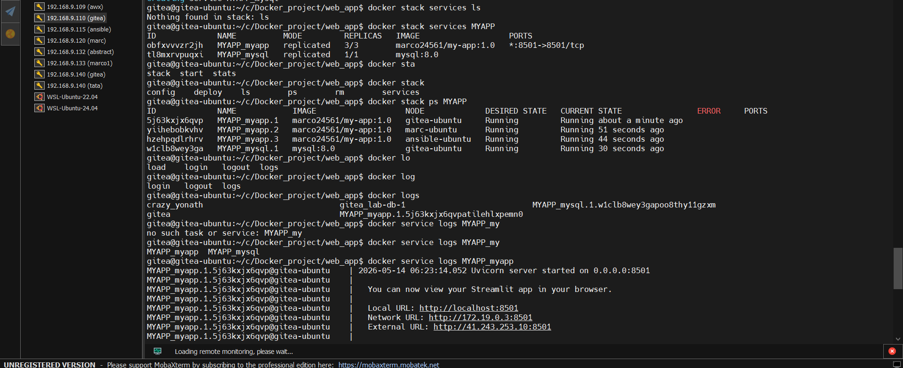
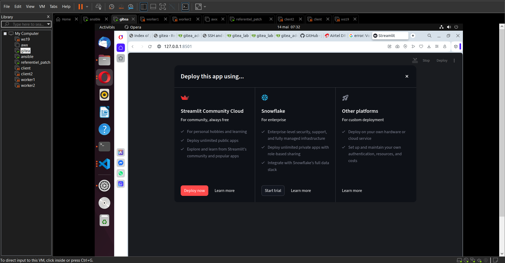

# 🚀  Conteneurisation et déploiement d'une application python avec base de données mysql


## Problématique

Le déploiement d’un service à fort trafic nécessite la mise en place de mécanismes permettant d’assurer sa disponibilité et sa continuité de fonctionnement. L’objectif est d’éviter les interruptions de service, de réduire le downtime et de garantir aux utilisateurs un accès continu aux différents services.


## 🚧 Ceci est un projet à but pédagogique

Le but principal du projet est de mettre en place une architecture scalable permettant d’assurer le fonctionnement du service tout en limitant les interruptions en cas de défaillance technique d’un nœud.

C’est pourquoi, dans le cadre de ce projet, nous allons utiliser **Docker Swarm** afin de rendre ce concept plus viable et de faciliter la gestion des différents nœuds et services.

La haute disponibilité concerne uniquement la couche applicative. La base de données MySQL n’est pas répliquée, conformément aux contraintes de sécurité et de conformité des données retenues pour ce projet.


## 🛠️ Prérequis

- Un cluster **Docker Swarm** fonctionnel (1 nœud Manager et au moins 2 nœuds Workers).
- Docker Engine installé et configuré en mode Swarm sur l'ensemble des machines.
- Une mise en réseau de différents noeuds
- Une bonne connectivité réseau

---

## 📁 Stucture générale du projet

La structure générale du projet se présente de la manière suivante:

```text
Docker-project/
├── Images/                                 # Différentes images et architecture du projet
├── stack/
│   ├── docker-compose/
│   │   ├── Vidéos/                         # Démos au format vidéo
│   │   ├── bdd.yml                         # Configuration de MYSQL via un fichier compose
│   ├── mongo.yml                           # Exemplaire de configuration de mongodb via un fichier compose (déploiement swarm)
│   └── nginx.yml                           # Exemplaire de configuration du serveur web nginx (déploiement via swarm)
├── web_app
│   ├── Hotel-Management-using-SQL-main/
|   ├── Images/                             # Différentes images liées au déploiement    
│   │   ├── deploy.yml                      # Fichier de déploiement swarm(projet plus MYSQL)
│   │   ├── Dockerfile                      # Construction d'image et bonnes pratiques
│   │   ├── w-db.sh                         # Script d'attente de la base de données
│   │   └── .env.exemple                    # Exemple de différentes valeurs pour la configuration 
└── └── README.md                           # Description générale du projet

```
---

# Output (Résultats attendus)

Comme Output, nous aurons:

1. Haute disponibilité activée  (`3/3` répliques fonctionnelles) :
   
   ```bash
   docker stack services MYAPP
   # Output attendu : MYAPP_myapp à 3/3 répliques
   ```
2. Distribution sur le cluster (Conteneurs répartis sur vos différents nœuds) :
   
   
    `MYAPP_myapp.1` branché sur le nœud __gitea-ubuntu__
    `MYAPP_myapp.2` branché sur le nœud __marc-ubuntu__
    `MYAPP_myapp.3` branché sur le nœud __ansible-ubuntu__ 

3. Application Streamlit prête :
   
   Les logs du service doivent confirmer que le serveur est actif et que l'interface est accessible via le port `8501`.
        
---

## Déploiement

Pour déployer ce projet, veuillez:

1. Clonez le dépôt Git sur votre nœud Manager :
   
    ```bash
    git clone git@github.com:jeanmarctsh/Docker_project.git
    cd Docker_project/web_app/Hotel-Management-using-SQL-main/
    ```
    > ⚠️ __Note importante__ : Assurez-vous d'avoir créé et configuré votre secret Docker Swarm.

2. Renseignement des valeurs

    Veuillez reneigner les différentes valeurs en fonctions de vos besoins

    veuillez créer le fichier .env à la racine du dossier web_app en vous référant au fichier .env.exemple et 
    adopter les valeurs en fonction de vos besoins

3. Déploiement de la Stack

    Depuis le nœud Manager uniquement , lancez le déploiement du service :

    ```bash
    cd Docker_project/web_app  && docker stack deploy -c deploy.yml MYAPP
    ```
4. Vérification du déploiement

    Après environ une minute, validez que l'application est correctement répartie et en Haute Disponibilité :

    ```bash
    docker stack services MYAPP
    ```

    L'output doit afficher `3/3` répliques pour le service web.

    ```bash
    docker stack ps MYAPP
    ```
    L'output doit montrer les conteneurs répartis sur vos différents nœuds (`Running`).

5. Application Streamlit prête

    Pour afficher les logs de l'application déployée afin de voir l'état général ainsi que le port `8501`, 
    veuillez saisir la commande :

    ```bash
    docker service logs MYAPP_myapp
    ```
Voici un extrait de l'affichage des logs après le déploiement:




# Accès rapide au service déployé avec docker swarm depuis le manager

| Service   | IP / Node accessible | Port publié | Description                                      |
|-----------|----------------------|-------------|--------------------------------------------------|
| MYAPP_my  | 127.0.0.1            | 8501        | Interface utilisateur accessible via navigateur  |

__L'application est accessible depuis le master ainsi que depuis deux workers__


# Accès rapide au service déployé avec docker swarm depuis le worker node

| Service   | IP / Node accessible | Port publié | Description                                      |
|-----------|----------------------|-------------|--------------------------------------------------|
| MYAPP_my  | IP DU WORKER NODE    | 8501        | Interface utilisateur accessible via navigateur  |

En image, cela se présente de la manière ci-après:


---

## ✍️ AUTEUR
- Nom : Ngandu Jean-Marc
- [](mailto:jeanmarctshimbombo@gmail.com)
- [](https://www.linkedin.com/in/jean-marc-ngandu-b60796222)
- [](https://github.com/jeanmarctsh)

